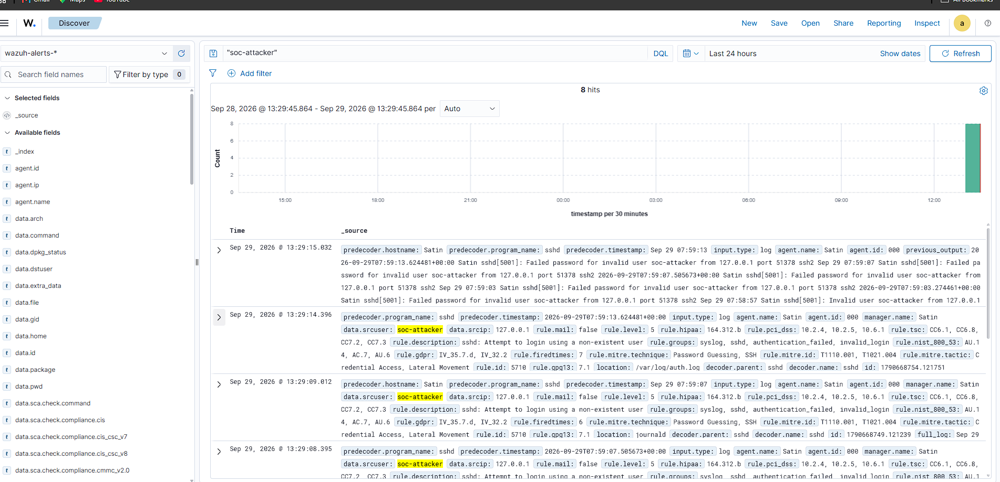
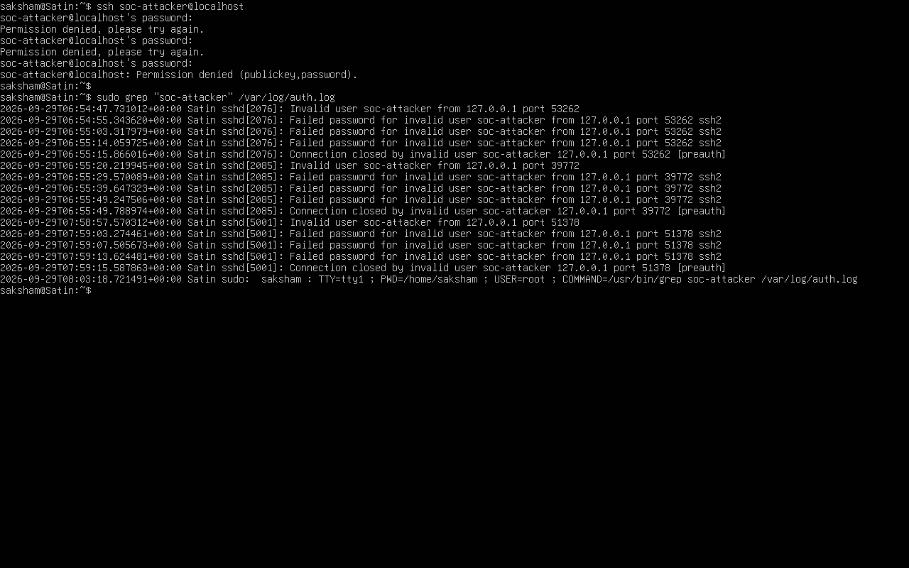
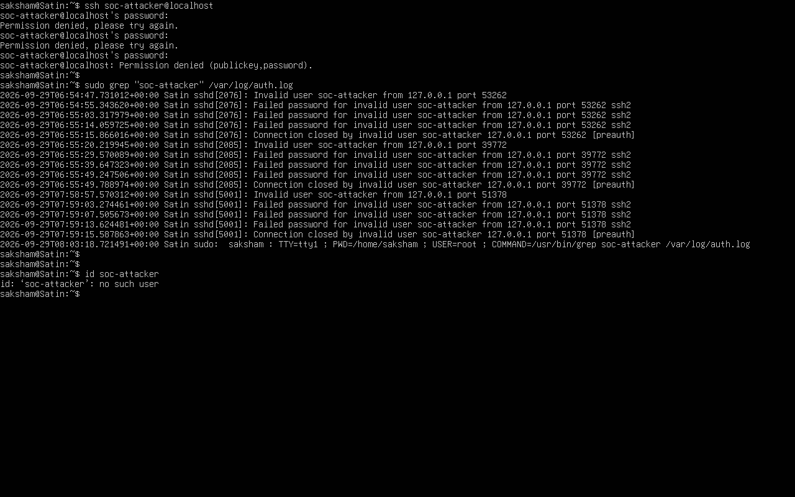
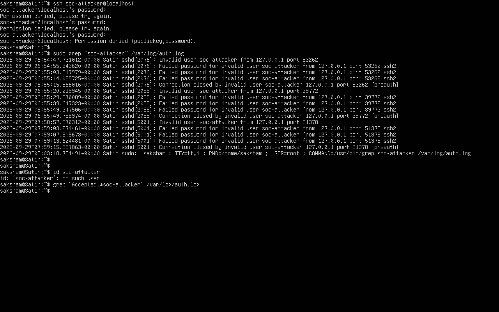

# Scenario 2: SSH Login Attempt Using a Non-Existent User

## Objective

Detect and investigate failed SSH login attempts involving a non-existent user.

## Activity

An SSH login attempt was made using the username `soc-attacker`.

The login attempt was unsuccessful because the authentication attempt was denied.

## Detection

The SSH activity was detected by Wazuh.

* **Rule ID:** 5710
* **Severity Level:** 5
* **Detection:** `sshd: Attempt to login using a non-existent user`

The alert indicated that an SSH login attempt was made using the non-existent username `soc-attacker`.

## Investigation

The authentication logs were reviewed on the Ubuntu endpoint to investigate the activity.

### Failed SSH Login

The authentication log was searched for activity involving `soc-attacker`. The failed login attempt was identified and the authentication attempt was denied.

### Account Verification

The `id` command was used to check the `soc-attacker` account.

### Successful Login Check

The authentication log was checked for an `Accepted` SSH login involving `soc-attacker`.

The command produced no output, indicating that no successful SSH login was found in the searched log entries.

## Investigation Summary

The SSH activity was detected and investigated using Wazuh and Linux authentication logs. The login attempt was unsuccessful, and no successful SSH login was identified during the investigation.
